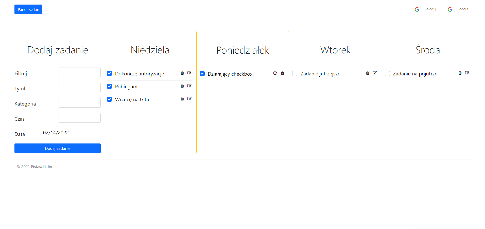
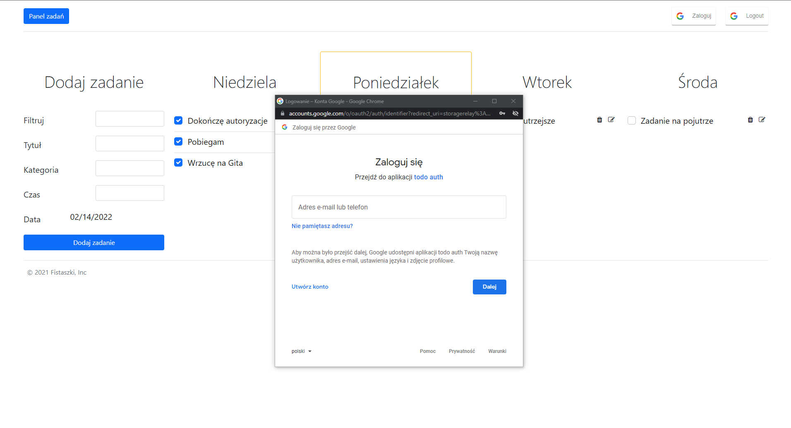
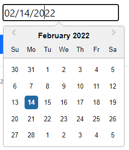

# Aplikacja Todo

> Celem aplikacji jest zarządzanie swoimi zadaniami w celu poprawy produktywności. Aplikacja została stworzona w duchu minimalizmu, każdy akcja jest pod ręką.

## Spis treści
* [Informacje ogólne](#1)
* [Technologia](#2)
* [Funkcjonalności](#3)
* [Dokumentacja](#4)
* [Przykład kodu](#5)
* [Kontakt](#6)

<a name="1"/>

## Informacje ogólne
Aplikacja pozwala na tworzenie zadań, edytowanie tytułów, usuwanie i zaznaczanie wykonanych zadań w określonym terminie.

[Backend aplikacji](https://github.com/DamianJaszewski/To-do-reactapp-backend/tree/master)

<a name="2"/>

## Technologie
* React.js - frontend
* MongoDB - database
* Express.js, Node.js  - backend
* CSS Bootstrap
* Google API -> Google OAuth 2.0 

<a name="3"/>

## Funkcjonalności
1) CRUD dla zadań:
* wyświetlanie zadań dla wybranego dnia
* dodawanie zadania wraz z wyborem daty
* edytowanie tytułu 
* zaznaczanie wykonanego zadania
* usuwanie zadania
* flitrowanie nazw zadań
2) Logowanie do aplikacji z wykorzystaniem api google

<a name="4"/>

## Dokumentacja




<a name="5"/>

## Przykład kodu

*Wykorzystanie placeholdera*
```js
<input type="text" placeholder={todo.title} onChange={(event) => {
  setNewTitle(event.target.value);
}}/>
```

*Model zadania*
```js
const todoSchema = mongoose.Schema({
  _id: mongoose.Types.ObjectId,
  userId:Number,
  category: String,
  title: String,
  date: Date,
  time: Number,
  completed: Boolean
});
```

*Zmiana statusu zadania*
```js
const updateTodoDone = (id, completed) =>{
    Axios.put(`http://localhost:3000/zadania/ukonczone/${id}`,{completed: completed})
    refreshPage();
  }
```

```js
exports.todos_put_change_done = (req, res, next) => {
  const id = req.params.id;
  const completed = req.body.completed;
  Todo.findByIdAndUpdate(
    id, 
    {
        "completed": ((completed == true) ? false : true),
    },
    {new:true}
    ).exec()
    .then(result => {

      res.status(200).json({
          wiadomość: "Zmiana zadania o numerze:" + id,
          info: result
       });

    })
    .catch(err => res.status(500).json({wiadomość:err}));
}
```

*Filtrowanie*
```js
 const[filteredTodo,setFilteredTodo] = useState(listOfTodo);

  const handleSearch = (event) => {
    let value = event.target.value;
    let result = [];
    result = listOfTodo.filter((data)=>{
      return data.title.search(value) != -1;
    })
    setFilteredTodo(result);
  }
```

<a name="6"/>

## Kontakt
Aplikację stworzyli:
Natalia Gościnna & Damian Jaszewski
